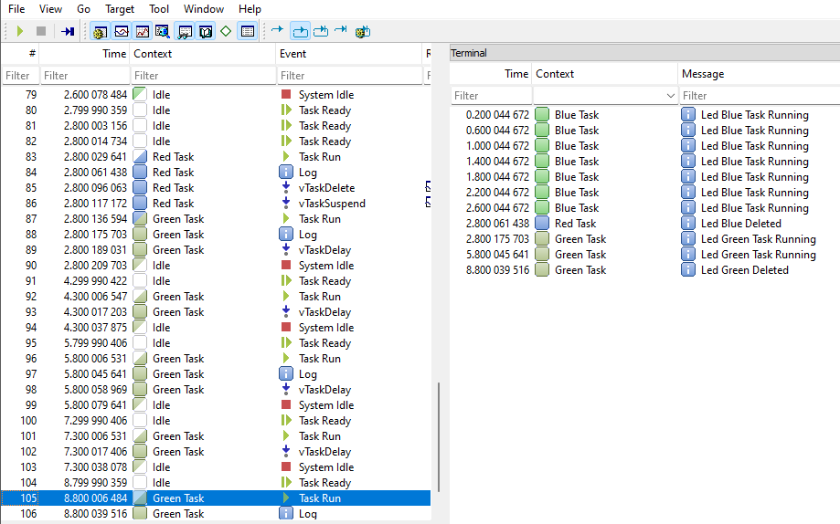
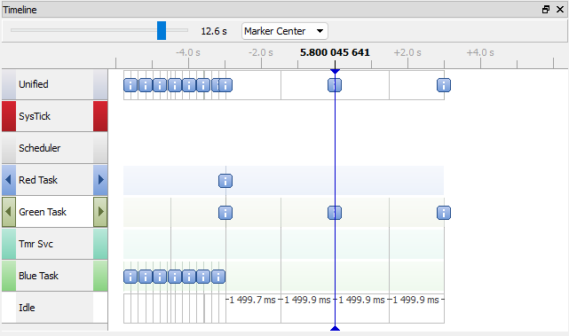

## Task Definition in FreeRTOs

## Overview
This is an example code that demonstrates the use of FreeRTOS on an STM32 microcontroller. It creates three tasks: one green, one blue, and one red task. Each task toggles an LED on the board and outputs a message to the ``Segger SystemView`` for debugging purposes.

The green task runs indefinitely, while the blue task deletes itself after a few iterations. The red task deletes the blue task and suspends itself after its first run.

## Requirements
To run this code, you will need the following:

* STM32 microcontroller
* FreeRTOS kernel
* Segger SystemView

## Setup
1. Initialize all the peripherals and the system clock.
2. Configure the GPIO pins for the LEDs.
3. Call the `SEGGER_SYSVIEW_Conf()` function to configure the Segger SystemView.
4. Create the three tasks, with different priorities and stack sizes:
  * The green task has the lowest priority and the smallest stack size.
  * The blue task has a higher priority and a larger stack size.
  * The red task has the highest priority and the same stack size as the green task.

5. Start the scheduler by calling `vTaskStartScheduler()`. This function should never return unless there is an issue with the FreeRTOS heap.
6. In the blue task, use `vTaskDelete(NULL)` to delete the task after a few iterations.
7. In the red task, use `vTaskDelete()` to delete the blue task and `vTaskSuspend()` to suspend itself after its first run.

## Usage
Once the setup is complete, the three tasks will start running, and the LEDs will toggle according to the code. The Segger SystemView will output messages to provide a better understanding of what is happening in the code.

## SYSTEM VIEW 
The image below shows the execution process for all the tasks created, you can see the debug messages sent by the function `SEGGER_SYSVIEW_PrintfHost`, it includes the task where it was called and the timestamp, it also show related information for the task context during the program execution. 

The timeline with the printf events is shown in the image below, here you can see the process described in **setup** points `5` to `7`.

